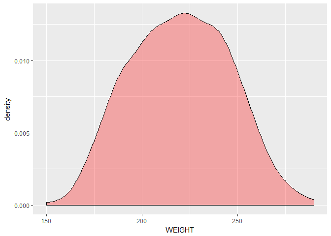
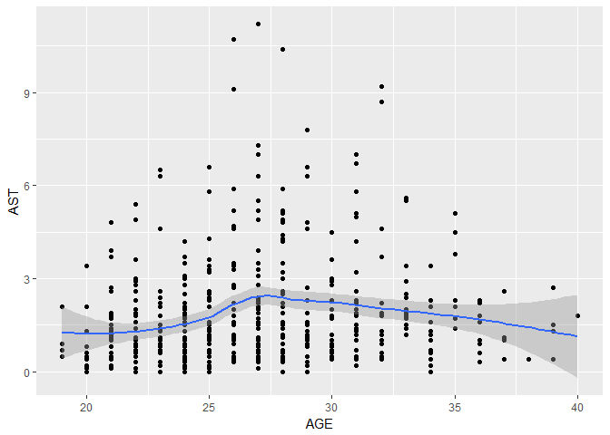

How do Physical Charateristics Relate to Performance in the NBA
================
Ajay Singh

<!-- Don't edit in between this line and the one below -->
*Source file* <a href='data:text/x-markdown;base64,LS0tDQp0aXRsZTogIkhvdyBkbyBQaHlzaWNhbCBDaGFyYXRlcmlzdGljcyBSZWxhdGUgdG8gUGVyZm9ybWFuY2UgaW4gdGhlIE5CQSINCmF1dGhvcjogIkFqYXkgU2luZ2giDQpkYXRlOiAiIg0Kb3V0cHV0OiANCiAgZ2l0aHViX2RvY3VtZW50DQotLS0NCjwhLS0gRG9uJ3QgZWRpdCBpbiBiZXR3ZWVuIHRoaXMgbGluZSBhbmQgdGhlIG9uZSBiZWxvdyAtLT4NCmBgYHtyIGluY2x1ZGU9RkFMU0Usd2FybmluZz1GQUxTRX0NCiMgRG9uJ3QgZGVsZXRlIHRoaXMgY2h1bmsgaWYgeW91IGFyZSB1c2luZyB0aGUgRGF0YUNvbXB1dGluZyBwYWNrYWdlDQpsaWJyYXJ5KERhdGFDb21wdXRpbmcpDQpsaWJyYXJ5KHJhbmRvbWNvbG9SKQ0KbGlicmFyeShrbml0cikNCmxpYnJhcnkocmVhZHhsKQ0KbGlicmFyeShydmVzdCkNCg0KYGBgDQoqU291cmNlIGZpbGUqIA0KYGBge3IsIHJlc3VsdHM9J2FzaXMnLCBlY2hvPUZBTFNFLCB3YXJuaW5nPUZBTFNFfQ0KaW5jbHVkZVNvdXJjZURvY3VtZW50cygpDQpgYGANCjwhLS0gRG9uJ3QgZWRpdCB0aGUgbWF0ZXJpYWwgYWJvdmUgdGhpcyBsaW5lIC0tPg0KDQojIyNEYXRhIGZyb20gWzIwMTYtMTcgc2Vhc29uXShodHRwOi8vc3RhdHMubmJhLmNvbS9wbGF5ZXJzL2Jpby8/U2Vhc29uPTIwMTYtMTcmU2Vhc29uVHlwZT1SZWd1bGFyJTIwU2Vhc29uJnNvcnQ9VVNHX1BDVCZkaXI9MSkNCg0KYGBge3IgZWNobz1GQUxTRSx3YXJuaW5nPUZBTFNFfQ0KUGxheWVyX0RhdGEgPC0gcmVhZF9leGNlbCgiQzovVXNlcnMvQWpheS9EZXNrdG9wL0ZpbmFsIERBVEEueGxzeCIsIA0KICAgICBjb2xfdHlwZXMgPSBjKCJza2lwIiwgInRleHQiLCAidGV4dCIsIA0KICAgICAgICAgIm51bWVyaWMiLCAibnVtZXJpYyIsICJudW1lcmljIiwgDQogICAgICAgICAidGV4dCIsICJ0ZXh0IiwgInRleHQiLCAidGV4dCIsICJ0ZXh0IiwgDQogICAgICAgICAibnVtZXJpYyIsICJudW1lcmljIiwgIm51bWVyaWMiLCANCiAgICAgICAgICJudW1lcmljIiwgInNraXAiLCAic2tpcCIsIA0KICAgICAgICAgInNraXAiLCAic2tpcCIsICJza2lwIiwgDQogICAgICAgICAic2tpcCIpKQ0KUGxheWVyX0RhdGEkQ09VTlRSWVtpcy5uYShQbGF5ZXJfRGF0YSRDT1VOVFJZKV0gPC0gYXMuY2hhcmFjdGVyKCJVU0EiKQ0KYGBgDQoNCmBgYHtyIGVjaG89RkFMU0Usd2FybmluZz1GQUxTRX0NCmNvbF92ZWN0b3IgPC0gdW5uYW1lKGRpc3RpbmN0Q29sb3JQYWxldHRlKDQ0KSkNCmBgYA0KDQpgYGB7ciBlY2hvPUZBTFNFLHdhcm5pbmc9RkFMU0V9DQojQ3JlYXRlcyBCTUkgZm9yIGVhY2ggcGxheWVyDQpCbWlfVGFibGUxPC0gUGxheWVyX0RhdGEgJT4lIG11dGF0ZShCTUk9IFdFSUdIVCouNDUvKEhFSUdIVCouMDI1KV4yKQ0KUGxheWVyX0RhdGEkQk1JPC1CbWlfVGFibGUxJEJNSQ0KI0NyZWF0ZXMgbmV3IHZhcmlhYmxlIFJhdGluZyB3aGljaCBpcyBhbiBhdmVyYWdlIG9mIGFsbCB0aHJlZSBvbiBjb3VydCBzdGF0cw0KQXZnUmF0aW5nPC1QbGF5ZXJfRGF0YSAlPiUgbXV0YXRlKEFWRz0gKFBUUytBU1QrUkVCKS8zKQ0KUGxheWVyX0RhdGEkQVZHPC0gQXZnUmF0aW5nJEFWRw0KYGBgDQoNCiMjMjAxNi0xNyBOQkEgUGxheWVyIERhdGENCg0KYGBge3IgZWNobz1GQUxTRSx3YXJuaW5nPUZBTFNFLCBmaWcuYWxpZ249J2NlbnRlcid9DQoNCmthYmxlKHNhbXBsZV9uKFBsYXllcl9EYXRhLDUpKQ0KYGBgDQoNClRoZSBCb2R5IG1hc3MgaW5kZXggKEJNSSkgaXMgYSBtZXRob2Qgb2YgY2F0ZWdvcml6aW5nIHRoZSB3ZWlnaHRzIG9mIHBlb3BsZSB1c2luZyB0aGVpciBoZWlnaHQgYW5kIHdlaWdodC4NClRoZSBBVkcgaXMgdGhlIGF2ZXJhZ2Ugb2YgdGhlIHRocmVlIG9uIGNvdXJ0IHN0YXRpc3RpY3MgZm9yIGVhY2ggcGxheWVyKFBvaW50cyxBc3Npc3RzLCBhbmQgUmVib3VuZHMpIHVzZWQgdG8gZGV0ZXJtaW5lIGhvdyBnb29kIHRoZSBwbGF5ZXIncyBwZXJmb3JtYW5jZSBpcyBvdmVyYWxsLg0KDQo8Y2VudGVyPiA8Zm9udCBzaXplID0iNSI+IEF2ZXJhZ2VzIG9mIFN0YXRzICA8L2ZvbnQ+IDwvY2VudGVyPg0KDQpgYGB7ciBlY2hvPUZBTFNFLCB3YXJuaW5nPUZBTFNFLCBmaWcuYWxpZ249J2NlbnRlcid9DQojQXZlcmFnZXMgb2YgbWVhbmluZ2Z1bCBkYXRhDQpBdmVyYWdlczwtZGF0YS5mcmFtZSgiSGVpZ2h0Ij1tZWFuKFBsYXllcl9EYXRhJEhFSUdIVCksDQogICAgICAgICAgICAgICAgICAgICAiV2VpZ2h0Ij1tZWFuKFBsYXllcl9EYXRhJFdFSUdIVCksDQogICAgICAgICAgICAgICAgICAgICAiQWdlIj0gbWVhbihQbGF5ZXJfRGF0YSRBR0UpLA0KICAgICAgICAgICAgICAgICAgICAgIkJNSSI9IG1lYW4oUGxheWVyX0RhdGEkQk1JKSwNCiAgICAgICAgICAgICAgICAgICAgICJQb2ludHNfcGVyX0dhbWUiPW1lYW4oUGxheWVyX0RhdGEkUFRTKSwNCiAgICAgICAgICAgICAgICAgICAgICJBc3Npc3RzIj0gbWVhbihQbGF5ZXJfRGF0YSRBU1QpLA0KICAgICAgICAgICAgICAgICAgICAgIlJlYm91bmRzIj1tZWFuKFBsYXllcl9EYXRhJFJFQiksDQogICAgICAgICAgICAgICAgICAgICAiT3ZlcmFsbF9QZXJmb3JtYW5jZSI9bWVhbihQbGF5ZXJfRGF0YSRBVkcpKQ0Ka2FibGUoQXZlcmFnZXMpDQpgYGANCg0KIyNEZW5zaXR5IFBsb3RzIGZvciBQaHlzaWNhbCBDaGFyYXRlcmlzdGljcw0KYGBge3IgZWNobz1GQUxTRSwgZmlnLmFsaWduPSAnY2VudGVyJ30NClBsYXllcl9EYXRhICU+JSBnZ3Bsb3QoYWVzKHg9SEVJR0hUKSkrZ2VvbV9kZW5zaXR5KGZpbGw9ImJsdWUiLGFscGhhPS4zKQ0KUGxheWVyX0RhdGEgJT4lIGdncGxvdChhZXMoeD1XRUlHSFQpKStnZW9tX2RlbnNpdHkoZmlsbD0icmVkIixhbHBoYT0uMykNClBsYXllcl9EYXRhICU+JSBnZ3Bsb3QoYWVzKHg9Qk1JKSkrZ2VvbV9kZW5zaXR5KGZpbGw9ImdyZWVuIixhbHBoYT0uMykNClBsYXllcl9EYXRhICU+JSBnZ3Bsb3QoYWVzKHg9QUdFKSkrZ2VvbV9kZW5zaXR5KGZpbGw9InllbGxvdyIsYWxwaGE9LjMpDQpQbGF5ZXJfRGF0YSAlPiUgZ2dwbG90KGFlcyh4PUFWRykpK2dlb21fZGVuc2l0eShmaWxsPSJwdXJwbGUiLGFscGhhPS4zKSt4bGFiKCJPdmVyYWxsIFBlcmZvcm1hbmNlIikNCmBgYA0KDQpgYGB7ciBlY2hvPUZBTFNFLGZpZy5hbGlnbj0nY2VudGVyJ30NCiNTY3JhcGUgQk1JIFRhYmxlIGZyb20gd2lraXBlZGlhDQpwYWdlPC0naHR0cHM6Ly9lbi53aWtpcGVkaWEub3JnL3dpa2kvQm9keV9tYXNzX2luZGV4Jw0KWHBhdGggPC0gJy8vKltAaWQ9Im13LWNvbnRlbnQtdGV4dCJdL2Rpdi90YWJsZVsyXScNCg0KVGFibGVfbGlzdDwtIHBhZ2UgJT4lDQogIHJlYWRfaHRtbCgpICU+JQ0KICBodG1sX25vZGVzKHhwYXRoID0gWHBhdGgpICU+JQ0KICBodG1sX3RhYmxlKGZpbGwgPSBUUlVFKQ0KQm1pX1RhYmxlIDwtIFRhYmxlX2xpc3RbWzFdXQ0KDQojTW9kaWZ5IFRhYmxlIHRvIE1ha2UgU2Vuc2UNCmNvbG5hbWVzKEJtaV9UYWJsZSkgPC0gYXMuY2hhcmFjdGVyKHVubGlzdChCbWlfVGFibGVbMSxdKSkNCkJtaV9UYWJsZSA8LSBCbWlfVGFibGVbLTEsLSg0OjUpXQ0KQm1pX1RhYmxlWywyXTwtIHN1YigiXiQiLDAsQm1pX1RhYmxlWywyXSkNCkJtaV9UYWJsZVssM108LSBzdWIoIl4kIiwiaW5mIixCbWlfVGFibGVbLDNdKQ0KDQprYWJsZShCbWlfVGFibGUpDQpgYGANCg0KQWNjb3JkaW5nIHRvIHRoaXMgdGFibGUgYnkgdGhlIFtXSE9dKGh0dHA6Ly9hcHBzLndoby5pbnQvYm1pL2luZGV4LmpzcD9pbnRyb1BhZ2U9aW50cm9fMy5odG1sKSBtb3N0IE5CQSBQbGF5ZXJzIGFyZSBvdmVyd2VpZ2h0IHNvIHRoaXMgc2hvd3MgQk1JIGlzIG5vdCB0aGUgYmVzdCBjaGFyYXRlcmlzdGljIHRvIHVzZS4NCg0KIyNIZWlnaHQgYW5kIFNjb3JpbmcgU3RhdHMNCmBgYHtyIGVjaG89RkFMU0UsIGZpZy5hbGlnbj0nY2VudGVyJ30NCiNIb3cgSGVpZ2h0cyBhbmQgT24gY291cnQgQXZlcmFnZXMgY29tcGFyZSBhbmQgYWRkcyBzbW9vdGhlciB3aXRoIGxpbmVhciBtZXRob2QNCmdncGxvdChkYXRhPVBsYXllcl9EYXRhLGFlcyh4PUhFSUdIVCx5PVBUUykpK2dlb21fcG9pbnQoKStzdGF0X3Ntb290aChtZXRob2Q9bG0pDQoNCmdncGxvdChkYXRhPVBsYXllcl9EYXRhLGFlcyh4PUhFSUdIVCx5PUFTVCkpK2dlb21fcG9pbnQoKStzdGF0X3Ntb290aChtZXRob2Q9bG0pDQoNCmdncGxvdChkYXRhPVBsYXllcl9EYXRhLGFlcyh4PUhFSUdIVCx5PVJFQikpK2dlb21fcG9pbnQoKStzdGF0X3Ntb290aChtZXRob2Q9bG0pDQoNCmdncGxvdChkYXRhPVBsYXllcl9EYXRhLGFlcyh4PUhFSUdIVCx5PUFWRykpK2dlb21fcG9pbnQoKStzdGF0X3Ntb290aChtZXRob2Q9bG0pK3lsYWIoIk92ZXJhbGwgUGVyZm9ybWFuY2UiKQ0KYGBgDQoNClRoZSBwb2ludHMgc2NvcmVkIHNlZW0gbm90IHRvIGRlcGVuZCBvbiBoZWlnaHQgaGVhdmlseSwgd2hpbGUgc2hvcnRlciBwbGF5ZXJzIHNlZW0gdG8gZ2V0IG1vcmUgYXNzaXN0cyBhbmQgdGFsbGVyIHBsYXllcnMgZ2V0IG1vcmUgcmVib3VuZHMuDQoNCiMjV2VpZ2h0IGFuZCBCTUkgQ29tcGFyZWQgdG8gQXZlcmFnZSBTY29yZXMNCiMjI0RvZXMgd2VpZ2h0IG9yIEJNSSBoYXZlIGEgcmVsYXRpb25zaGlwIHRvIHBlcmZvcm1hbmNlPw0KYGBge3IgZWNobz1GQUxTRSxmaWcuYWxpZ249J2NlbnRlcid9DQojIENvbXBhcmlzb24gb2Ygd2VpZ2h0IGFuZCBCTUkgdG8gQVZHIHNjb3JlcyB0byBzZWUgYW5kIGxpbmVhciBwYXR0ZXJucyBBVkcgb25seSB1c2VkIHNpbmNlIGhlaWdodCBpcyBjb25zaWRlcmVkIG1vc3QgaW1wb3J0YW50IGluIE5CQSBhbmQgdG8gcmVkdWNlIGNsdXR0ZXIgaW4gUmVwb3J0DQpQbGF5ZXJfRGF0YSAlPiUgZ2dwbG90KGFlcyh4PVdFSUdIVCwgeT1BVkcpKStnZW9tX3BvaW50KCkrc3RhdF9zbW9vdGgobWV0aG9kPWxtKSt5bGFiKCJPdmVyYWxsIFBlcmZvcm1hbmNlIikNClBsYXllcl9EYXRhICU+JSBnZ3Bsb3QoYWVzKHg9Qk1JLCB5PUFWRykpK2dlb21fcG9pbnQoKStzdGF0X3Ntb290aChtZXRob2Q9bG0pK3lsYWIoIk92ZXJhbGwgUGVyZm9ybWFuY2UiKQ0KYGBgDQoNClNpbmNlIGhlaWdodCBpcyB1c3VhbGx5IHRoZSBiaWdnZXN0IGRldGVybWluaW5nIGZhY3RvciBJIGRpZG4ndCBhbmFseXplIHRoZSB3ZWlnaHQgZXh0ZW5zaXZlbHkgZm9yIGVhY2ggc3RhdGlzdGljIGJ1dCBqdXN0IHVzZWQgdGhlIGF2ZXJhZ2VzLiBUaGVyZSBzZWVtcyB0byBiZSBubyByZWFsIHBhdHRlcm4gd2l0aCB3ZWlnaHQgYnV0IHRoZSBvdmVyYWxsIHBlcmZvcm1hY2Ugc2VlbXMgdG8gZ28gdXAgd2l0aCBCTUkNCg0KIyNBZ2UgYW5kIFNjb3JpbmcgU3RhdHMNCiMjI0hvdyBkb2VzIHRoZSBhZ2Ugb2YgdGhlIHBsYXllciByZWxhdGUgdG8gaG93IHdlbGwgdGhleSBwbGF5Pw0KYGBge3IgZWNobz1GQUxTRSxmaWcuYWxpZ249J2NlbnRlcid9DQojSG93IEFnZSBhbmQgb24gY291cnQgYXZlcmFnZXMgY29tcGFyZSBhZGRlZCBwb2x5bm9taWFsIHJlZ3Jlc3Npb24gdG8gc2hvdyBwYXR0ZXJuDQpQbGF5ZXJfRGF0YSAlPiUgZ2dwbG90KGFlcyh4PUFHRSwgeT1QVFMpKStnZW9tX3BvaW50KCkrc3RhdF9zbW9vdGgobWV0aG9kPWxvZXNzKQ0KUGxheWVyX0RhdGEgJT4lIGdncGxvdChhZXMoeD1BR0UsIHk9QVNUKSkrZ2VvbV9wb2ludCgpK3N0YXRfc21vb3RoKG1ldGhvZD1sb2VzcykNClBsYXllcl9EYXRhICU+JSBnZ3Bsb3QoYWVzKHg9QUdFLCB5PVJFQikpK2dlb21fcG9pbnQoKStzdGF0X3Ntb290aChtZXRob2Q9bG9lc3MpDQpQbGF5ZXJfRGF0YSAlPiUgZ2dwbG90KGFlcyh4PUFHRSwgeT1BVkcpKStnZW9tX3BvaW50KCkrc3RhdF9zbW9vdGgobWV0aG9kPWxvZXNzKSt5bGFiKCJPdmVyYWxsIFBlcmZvcm1hbmNlIikNCmBgYA0KVGhlIGFnZSBvZiB0aGUgcGxheWVycyB3aG8gc2VlbSB0byBoYXZlIHRoZSBiZXN0IHJlY29yZHMgaXMgY29uc2lzdGVudGx5IHdpdGhpbiB0aGUgcmFuZ2Ugb2YgMjUgYW5kIDMwIHllYXJzIG9sZA0KDQojI0NvdW50cmllcyBvZiBvcmlnaW4gaW4gTkJBDQojIyNDb3VsZCB0aGVyZSBiZSBhIHJlbGF0aW9uIGZyb20gd2hlcmUgdGhlIHBsYXllcnMgYXJlIGZyb20gYW5kIGhvdyB3ZWxsIHRoZXkgcGVyZm9ybT8NCmBgYHtyIGVjaG89RkFMU0UsIGZpZy5hbGlnbj0nY2VudGVyJ30NCiNDcmVhdGUgdGFibGUgd2l0aCBob3cgbWFueSBwbGF5ZXJzIGFyZSBmcm9tIGVhY2ggY291bnRyeQ0KQ291bnRyaWVzPC0gUGxheWVyX0RhdGEgJT4lIGNvdW50KENPVU5UUlkpDQoNCiNwbG90IG9mIGNvdW50cmllcyBpbiBwaWUgZ3JhcGgNCnBpZSA8LSBDb3VudHJpZXMgJT4lIGdncGxvdChhZXMoeD0iIix5PW4sIGZpbGw9Q09VTlRSWSkpK2dlb21fYmFyKHdpZHRoID0gMSxzdGF0PSJpZGVudGl0eSIpDQoNCnBpZStjb29yZF9wb2xhcigieSIsc3RhcnQgPSAwKStzY2FsZV9maWxsX21hbnVhbCh2YWx1ZXMgPSBjb2xfdmVjdG9yKSsNCiAgdGhlbWUoYXhpcy50aXRsZS54PWVsZW1lbnRfYmxhbmsoKSwNCiAgICAgICAgYXhpcy50ZXh0Lng9ZWxlbWVudF9ibGFuaygpLA0KICAgICAgICBheGlzLnRpY2tzLng9ZWxlbWVudF9ibGFuaygpKSsNCiAgdGhlbWUoYXhpcy50aXRsZS55PWVsZW1lbnRfYmxhbmsoKSkNCmBgYA0KDQojI0NvdW50cnkgb2Ygb3JpZ2luIGFuZCBTY29yaW5nIFN0YXRzDQoNCmBgYHtyIGVjaG89RkFMU0UsZmlnLmFsaWduPSdjZW50ZXInfQ0KQXZnUHRzPC1QbGF5ZXJfRGF0YSAlPiUgZ3JvdXBfYnkoQ09VTlRSWSkgJT4lIHN1bW1hcmlzZShhdmc9bWVhbihQVFMpKQ0KQXZnUHRzJENPVU5UUlk8LWFzLmZhY3RvcihBdmdQdHMkQ09VTlRSWSkNCmdncGxvdChkYXRhPUF2Z1B0cyxhZXMoeD1DT1VOVFJZLHk9YXZnICxmaWxsPUNPVU5UUlkpKSsNCiAgZ2VvbV9iYXIoc3RhdD0naWRlbnRpdHknLHBvc2l0aW9uPSdkb2RnZScsIHdpZHRoPTEpKw0KICBzY2FsZV9maWxsX21hbnVhbCh2YWx1ZXMgPSBjb2xfdmVjdG9yKSt5bGFiKCJBdmVyYWdlIFBvaW50cyBwZXIgR2FtZSIpKw0KICBzY2FsZV94X2Rpc2NyZXRlKGxpbWl0cyA9IHJldihsZXZlbHMoQXZnUHRzJENPVU5UUlkpKSkrY29vcmRfZmxpcCgpDQpgYGANCg0KDQpgYGB7ciBlY2hvPUZBTFNFLGZpZy5hbGlnbj0nY2VudGVyJ30NCkF2Z0FzdDwtUGxheWVyX0RhdGEgJT4lIGdyb3VwX2J5KENPVU5UUlkpICU+JSBzdW1tYXJpc2UoYXZnPW1lYW4oQVNUKSkNCkF2Z0FzdCRDT1VOVFJZPC1hcy5mYWN0b3IoQXZnQXN0JENPVU5UUlkpDQpnZ3Bsb3QoZGF0YT1BdmdBc3QsYWVzKHg9Q09VTlRSWSx5PWF2ZyAsZmlsbD1DT1VOVFJZKSkrDQogIGdlb21fYmFyKHN0YXQ9J2lkZW50aXR5Jyxwb3NpdGlvbj0nZG9kZ2UnLCB3aWR0aD0xKSsNCiAgc2NhbGVfZmlsbF9tYW51YWwodmFsdWVzID0gY29sX3ZlY3RvcikreWxhYigiQXZlcmFnZSBBc3Npc3RzIHBlciBHYW1lIikrDQogIHNjYWxlX3hfZGlzY3JldGUobGltaXRzID0gcmV2KGxldmVscyhBdmdBc3QkQ09VTlRSWSkpKStjb29yZF9mbGlwKCkNCmBgYA0KDQoNCmBgYHtyIGVjaG89RkFMU0UsZmlnLmFsaWduPSdjZW50ZXInfQ0KQXZnUmViPC1QbGF5ZXJfRGF0YSAlPiUgZ3JvdXBfYnkoQ09VTlRSWSkgJT4lIHN1bW1hcmlzZShhdmc9bWVhbihSRUIpKQ0KQXZnUmViJENPVU5UUlk8LWFzLmZhY3RvcihBdmdSZWIkQ09VTlRSWSkNCmdncGxvdChkYXRhPUF2Z1JlYixhZXMoeD1DT1VOVFJZLHk9YXZnICxmaWxsPUNPVU5UUlkpKSsNCiAgZ2VvbV9iYXIoc3RhdD0naWRlbnRpdHknLHBvc2l0aW9uPSdkb2RnZScsIHdpZHRoPTEpKw0KICBzY2FsZV9maWxsX21hbnVhbCh2YWx1ZXMgPSBjb2xfdmVjdG9yKSt5bGFiKCJBdmVyYWdlIFJlYm91bmRzIHBlciBHYW1lIikrDQogIHNjYWxlX3hfZGlzY3JldGUobGltaXRzID0gcmV2KGxldmVscyhBdmdSZWIkQ09VTlRSWSkpKStjb29yZF9mbGlwKCkNCmBgYA0KDQoNCmBgYHtyIGVjaG89RkFMU0UsZmlnLmFsaWduPSdjZW50ZXInfQ0KQXZnU2NvcmU8LVBsYXllcl9EYXRhICU+JSBncm91cF9ieShDT1VOVFJZKSAlPiUgc3VtbWFyaXNlKGF2Zz1tZWFuKEFWRykpDQpBdmdTY29yZSRDT1VOVFJZPC1hcy5mYWN0b3IoQXZnU2NvcmUkQ09VTlRSWSkNCmdncGxvdChkYXRhPUF2Z1Njb3JlLGFlcyh4PUNPVU5UUlkseT1hdmcgLGZpbGw9Q09VTlRSWSkpKw0KICBnZW9tX2JhcihzdGF0PSdpZGVudGl0eScscG9zaXRpb249J2RvZGdlJywgd2lkdGg9MSkrDQogIHNjYWxlX2ZpbGxfbWFudWFsKHZhbHVlcyA9IGNvbF92ZWN0b3IpK3lsYWIoIkF2ZXJhZ2UgU2NvcmUiKSsNCiAgc2NhbGVfeF9kaXNjcmV0ZShsaW1pdHMgPSByZXYobGV2ZWxzKEF2Z1Njb3JlJENPVU5UUlkpKSkrY29vcmRfZmxpcCgpK3lsYWIoIk92ZXJhbGwgUGVyZm9ybWFuY2UiKQ0KYGBgDQpXZSBjYW4gc2VlIHRoZXJlIGlzIG5vIHJlYWwgcmVhbHRpb25zaGlwIGJldHdlZW4gc2NvcmluZyBhbmQgdGhlIGNvdW50cnkgb2Ygb3JpZ2luLg0KDQojI0NhbiB3ZSBkZXRlcm1pbmUgd2hhdCBwaHlzaWNhbCBjaGFyYXRlcmlzdGljcyBtYWtlIHRoZSBiZXN0IHBsYXllcnM/DQojIyNXZSBkZXRlcm1pbmVkIHRoYXQgdGhlIGJlc3QgcGxheWVycyBoYXZlIGhlaWdodHMgYmV0d2VlbiA3NSBhbmQgODEgaW5jaGVzIGFuZCBhcmUgMjUgdG8gMzAgeWVhcnMgb2xkDQoNCmBgYHtyIGVjaG89RkFMU0V9DQpCZXN0X1BsYXllciA8LSBmaWx0ZXIoUGxheWVyX0RhdGEsIEhFSUdIVCA+IDc0LCBBR0UgPiAyNSkNCkJlc3RfUGxheWVyIDwtIEJlc3RfUGxheWVyICU+JSBmaWx0ZXIoSEVJR0hUIDwgODEsIEFHRSA8IDMwKQ0KQmVzdF9QbGF5ZXIgPC0gQmVzdF9QbGF5ZXIgJT4lIGFycmFuZ2UoZGVzYyhBVkcpKQ0KDQprYWJsZShoZWFkKEJlc3RfUGxheWVyLDUpKQ0KYGBgDQoNCkZyb20gdGhpcyB0YWJsZSB3aGljaCBoYXMgZmlsdGVyZWQgb3V0IHRoZSBwbGF5ZXJzIGluIHRoZXNlIHJhbmdlcyBhbmQgd2FzIHRoZW4gc29ydGVkIGJ5IHRoZSBvdmVyYWxsIHBlcmZvcm1hbmNlIHNjb3JlIHdlIGNhbiBzZWUgdGhhdCB0aGVyZSBhcmUgdmVyeSBmYW1vdXMgbmFtZXMgaW4gdGhpcyB0YWJsZSBlc3BlY2lhbGx5IFJ1c3NlbGwgV2VzdGJyb29rIHRoZSBNVlAgZm9yIHRoaXMgc2Vhc29uLiANCg0KIyNIb3cgZWFjaCB0ZWFtIGlzIGJhbGFuY2VkIGluIHRlcm1zIG9mIHBoeXNpY2FsIGNoYXJhY3RlcmlzdGljcyANCiMjI0RvZXMgQmFsYW5jZSBsZWFkIHRvIGJldHRlciB0ZWFtcz8NCmBgYHtyIGVjaG89RkFMU0UsIGZpZy5hbGlnbj0nY2VudGVyJywgZmlnLmhlaWdodD0gOCwgZmlnLndpZHRoPTExfQ0KI0RlbnNpdHkgcGxvdCBvZiBoZWlnaHRzIGZvciBlYWNoIHRlYW0NCmdncGxvdChkYXRhPVBsYXllcl9EYXRhLGFlcyh4PUhFSUdIVCkpK2dlb21fZGVuc2l0eShmaWxsPSJibHVlIixhbHBoYT0uMykrZmFjZXRfd3JhcCh+VEVBTSxuY29sPTQpDQoNCmdncGxvdChkYXRhPVBsYXllcl9EYXRhLGFlcyh4PVdFSUdIVCkpK2dlb21fZGVuc2l0eShmaWxsPSJyZWQiLGFscGhhPS4zKStmYWNldF93cmFwKH5URUFNLG5jb2w9NCkNCg0KDQpnZ3Bsb3QoZGF0YT1QbGF5ZXJfRGF0YSxhZXMoeD1CTUkpKStnZW9tX2RlbnNpdHkoZmlsbD0iZ3JlZW4iLGFscGhhPS4zKStmYWNldF93cmFwKH5URUFNLG5jb2w9NCkNCg0KDQpnZ3Bsb3QoZGF0YT1QbGF5ZXJfRGF0YSxhZXMoeD1BR0UpKStnZW9tX2RlbnNpdHkoZmlsbD0ieWVsbG93IixhbHBoYT0uMykrZmFjZXRfd3JhcCh+VEVBTSxuY29sPTQpDQoNCg0KZ2dwbG90KGRhdGE9UGxheWVyX0RhdGEsYWVzKHg9QVZHKSkrZ2VvbV9kZW5zaXR5KGZpbGw9InB1cnBsZSIsYWxwaGE9LjMpK2ZhY2V0X3dyYXAoflRFQU0sbmNvbD00KSt4bGFiKCJPdmVyYWxsIFBlcmZvcm1hbmNlIikNCmBgYA0KDQpUaGUgR29sZGVuIFN0YXRlIFdhcnJpb3JzKEdTVykgYW5kIENsZXZlbGFuZCBDYXZhbGllcnMoQ0xFKSB3ZXJlIHRoZSBmaW5hbGlzdCBpbiBsYXN0IHllYXJzIE5CQSBjaGFtcGlvbnNoaXAgd2UgY2FuIHNlZSB0aGF0IEdTVyBoYXMgYSBoaWdoZXIgYW1vdW50IG9mIHBsYXllciBpbiB0aGUgNzUgaW5jaCByYW5nZSB0aGVuIENMRS4gQm90aCB0ZWFtcyBzZWVtIHRvIGhhdmUgYSBnb29kIGRpc3RyaWJ1dGlvbiBvZiBhZ2UgaW4gdGhlaXIgdGVhbXMuIA0KDQpXaGlsZSBSdXNzZWxsIFdlc3Ricm9vayBvZiBPS0MgYW5kIEphbWVzIEhhcmRlbiAoSE9VKSBhcmUgdHdvIHRoZSBiZXN0IG92ZXJhbGwgTkJBIHBsYXllcnMgdGhlaXIgdGVhbXMgaW4gdGVybXMgb2YgZXZlbiBkaXN0cmlidXRpb24gb2YgYWdlIGlzIG1vcmUgdG93YXJkcyB5b3VuZ2VyIHBsYXllcnMgZXNwZWNpYWxseSBva2MgYW5kIHRoZXJlIGlzIGEgZGlwIGluIHRoZSBpZGVhbCByYW5nZSBpbiB0ZXJtcyBvZiBoZWlnaHQgdGhhdCB3YXMgZGV0ZXJtaW5lZCBlYXJsaWVyLg0KDQpDb3VsZCB0aGlzIGlkZWFsIGJhbGFuY2Ugb2YgcGh5c2ljYWwgY2hhcmF0ZXJpc3RpY3MgYW5kIGJhbGFuY2UgYmUgdXNlZCB0byBkZXRlcm1pbmUgd2hvIHdpbGwgYmUgc3VjY2VzZnVsbCBpbiB0aGUgTkJBPw0KDQpQcm9iYWJseSBub3Qgc2luY2Ugc2tpbGwgYW5kIG90aGVyIGZhY3RvcnMgdGhhdCBkZXRlcmltbmUgc3VjY2VzcyBhcmUgaGFyZCB0byBxdWFudGlmeSBhbmQgZm9yIGJldHRlciBtb2RlbCB0byBiZSBtYWRlIGRhdGEgZnJvbSBtdWx0aXBsZSBzZWFzb25zIGhhcyB0byBiZSB1c2VkIGZvciBtb3JlIGFjY3VyYXRlIGRlc2NyaXB0aW9uLg==' target='_blank' title='User Ajay at C:/Users/Ajay/Documents' download='NBA_Players.Rmd'> ⇒ NBA\_Players.Rmd</a>
<!-- Don't edit the material above this line -->

### Data from [2016-17 season](http://stats.nba.com/players/bio/?Season=2016-17&SeasonType=Regular%20Season&sort=USG_PCT&dir=1)

2016-17 NBA Player Data
-----------------------

| PLAYER              | TEAM |  AGE|  HEIGHT|  WEIGHT| COLLEGE         | COUNTRY | DRAFT YEAR | DRAFT ROUND | DRAFT NUMBER |   GP|   PTS|  REB|  AST|       BMI|        AVG|
|:--------------------|:-----|----:|-------:|-------:|:----------------|:--------|:-----------|:------------|:-------------|----:|-----:|----:|----:|---------:|----------:|
| Eric Gordon         | HOU  |   28|      76|     215| Indiana         | USA     | 2008       | 1           | 7            |   75|  16.2|  2.7|  2.5|  26.80055|   7.133333|
| Kyle Lowry          | TOR  |   31|      72|     205| Villanova       | USA     | 2006       | 1           | 24           |   60|  22.4|  4.8|  7.0|  28.47222|  11.400000|
| Cody Zeller         | CHA  |   24|      84|     240| Indiana         | USA     | 2013       | 1           | 4            |   62|  10.3|  6.5|  1.6|  24.48980|   6.133333|
| Johnny O'Bryant III | CHA  |   24|      81|     257| Louisiana State | USA     | 2014       | 2           | 36           |   11|   3.5|  1.7|  0.5|  28.20302|   1.900000|
| Cole Aldrich        | MIN  |   28|      83|     250| Kansas          | USA     | 2010       | 1           | 11           |   62|   1.7|  2.5|  0.4|  26.12861|   1.533333|

The Body mass index (BMI) is a method of categorizing the weights of people using their height and weight. The AVG is the average of the three on court statistics for each player(Points,Assists, and Rebounds) used to determine how good the player's performance is overall.

|    Height|    Weight|       Age|       BMI|  Points\_per\_Game|   Assists|  Rebounds|  Overall\_Performance|
|---------:|---------:|---------:|---------:|------------------:|---------:|---------:|---------------------:|
|  79.09877|  220.1214|  26.84774|  25.26232|           8.426749|  1.830247|  3.565226|              4.607407|

Averages for the Data in the table

Density Plots for Physical Charateristics
-----------------------------------------

|   Category of Weight                  | From | To   |
|---------------------------------------|:-----|:-----|
| Very severely underweight             | 0    | 15   |
| Severely underweight                  | 15   | 16   |
| Underweight                           | 16   | 18.5 |
| Normal (healthy weight)               | 18.5 | 25   |
| Overweight                            | 25   | 30   |
| Obese Class I (Moderately obese)      | 30   | 35   |
| Obese Class II (Severely obese)       | 35   | 40   |
| Obese Class III (Very severely obese) | 40   | inf  |

According to this table by the [WHO](http://apps.who.int/bmi/index.jsp?introPage=intro_3.html) most NBA Players are overweight so this shows BMI is not the best charateristic to use.

Height and Scoring Stats
------------------------

The points scored seem not to depend on height heavily, while shorter players seem to get more assists and taller players get more rebounds.

Weight and BMI Compared to Average Scores
-----------------------------------------

### Does weight or BMI have a relationship to performance?

Since height is usually the biggest determining factor I didn't analyze the weight extensively for each statistic but just used the averages. There seems to be no real pattern with weight but the overall performace seems to go up with BMI

Age and Scoring Stats
---------------------

### How does the age of the player relate to how well they play?

 The age of the players who seem to have the best records is consistently within the range of 25 and 30 years old

Countries of origin in NBA
--------------------------

### Could there be a relation from where the players are from and how well they perform?

Country of origin and Scoring Stats
-----------------------------------

 We can see there is no real realtionship between scoring and the country of origin.

Can we determine what physical charateristics make the best players?
--------------------------------------------------------------------

### We determined that the best players have heights between 75 and 81 inches and are 25 to 30 years old

| PLAYER            | TEAM |  AGE|  HEIGHT|  WEIGHT| COLLEGE             | COUNTRY | DRAFT YEAR | DRAFT ROUND | DRAFT NUMBER |   GP|   PTS|   REB|   AST|       BMI|       AVG|
|:------------------|:-----|----:|-------:|-------:|:--------------------|:--------|:-----------|:------------|:-------------|----:|-----:|-----:|-----:|---------:|---------:|
| Russell Westbrook | OKC  |   28|      75|     200| UCLA                | USA     | 2008       | 1           | 4            |   81|  31.6|  10.7|  10.4|  25.60000|  17.56667|
| James Harden      | HOU  |   27|      77|     220| Arizona State       | USA     | 2009       | 1           | 3            |   81|  29.1|   8.1|  11.2|  26.71614|  16.13333|
| John Wall         | WAS  |   26|      76|     210| Kentucky            | USA     | 2010       | 1           | 1            |   78|  23.1|   4.2|  10.7|  26.17729|  12.66667|
| Damian Lillard    | POR  |   26|      75|     195| Weber State         | USA     | 2012       | 1           | 6            |   75|  27.0|   4.9|   5.9|  24.96000|  12.60000|
| DeMar DeRozan     | TOR  |   27|      79|     220| Southern California | USA     | 2009       | 1           | 9            |   74|  27.3|   5.2|   3.9|  25.38055|  12.13333|

From this table which has filtered out the players in these ranges and was then sorted by the overall performance score we can see that there are very famous names in this table especially Russell Westbrook the MVP for this season.

How each team is balanced in terms of physical characteristics
--------------------------------------------------------------

### Does Balance lead to better teams?

The Golden State Warriors(GSW) and Cleveland Cavaliers(CLE) were the finalist in last years NBA championship we can see that GSW has a higher amount of player in the 75 inch range then CLE. Both teams seem to have a good distribution of age in their teams.

While Russell Westbrook of OKC and James Harden (HOU) are two the best overall NBA players their teams in terms of even distribution of age is more towards younger players especially okc and there is a dip in the ideal range in terms of height that was determined earlier.

Could this ideal balance of physical charateristics and balance be used to determine who will be succesfull in the NBA?

Probably not since skill and other factors that deterimne success are hard to quantify and for better model to be made data from multiple seasons has to be used for more accurate description.
